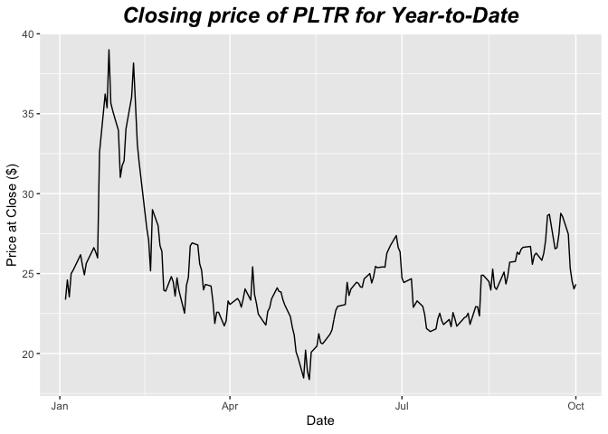
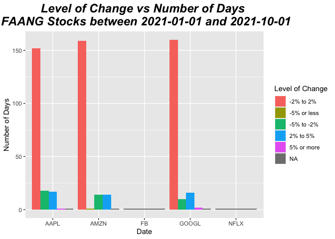
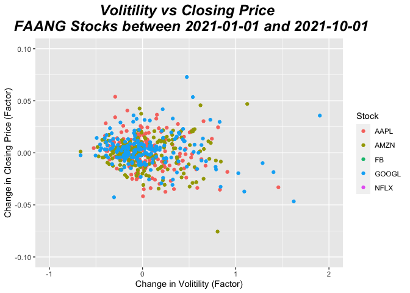
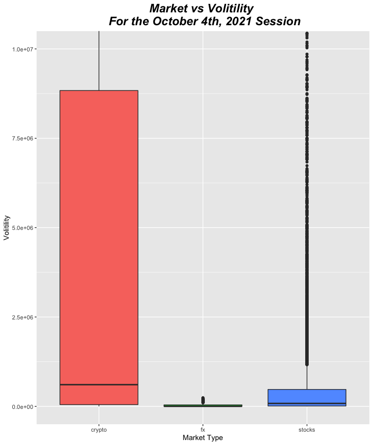

Interacting with Polygon Financial Data API
================
David Shaw
10/1/2021

-   [1 Requirements](#requirements)
-   [2 API Interactions](#api-interactions)
    -   [2.1
        `tickerPrices(ticker, timespan, from, to)`](#tickerpricesticker-timespan-from-to)
    -   [2.2
        `marketPricesAll(market, date)`](#marketpricesallmarket-date)
    -   [2.3 `tickerInfo(ticker)`](#tickerinfoticker)
    -   [2.4 `marketInfo(market)`](#marketinfomarket)
    -   [2.5 `stockSplit(ticker)`](#stocksplitticker)
    -   [2.6
        `stockFinancials(ticker, limit)`](#stockfinancialsticker-limit)
-   [3 Exploratory Analysis](#exploratory-analysis)
    -   [3.1 Palantir (PLTR) Analysis](#palantir-pltr-analysis)
    -   [3.2 FAANG Analysis](#faang-analysis)
    -   [3.3 Markets Analysis](#markets-analysis)

# 1 Requirements

The following packages must be installed using
`install.packages('packageName')` and imported into environment using
`library(packageName)`

-   [tidyverse](https://www.tidyverse.org/)
-   [httr](https://cran.r-project.org/web/packages/httr/vignettes/quickstart.html)
-   [jsonlite](https://cran.r-project.org/web/packages/jsonlite/vignettes/json-aaquickstart.html)
-   [chron](https://cran.r-project.org/web/packages/chron/chron.pdf)

Accessing the API

-   Retrieve API token at <https://polygon.io/docs/getting-started>

# 2 API Interactions

First, place your api token in a global variable called API_TOKEN

``` r
API_TOKEN='xxxx'
```

## 2.1 `tickerPrices(ticker, timespan, from, to)`

Get data for specified ticker over desired timespan between dates
specified by from and to.

Parameters:

-   `ticker`: ticker symbol of stock/forex/crypto asset
    -   Stocks have a ticker that is no more than 4 letters, all
        capitalized (ex.
        [Apple](https://finance.yahoo.com/quote/AAPL?p=AAPL&.tsrc=fin-srch)
        is AAPL)
    -   Forex has a ticker that begins with ‘C:’ followed by identifier
        (ex.
        [EUR/USD](https://finance.yahoo.com/quote/EURUSD%3DX?p=EURUSD%3DX)
        is C:EURUSD)
    -   Crypto has a ticker that begins with ‘X:’ followed by an
        identifier (ex.
        [Bitcoin](https://finance.yahoo.com/quote/BTC-USD/) is X:BTCUSD)
-   `timespan`: time between measurements (minute, hour, day, week,
    month, quarter, year)
-   `from`: date to collect market prices from in format YYYY-mm-dd
-   `to`: date to collect market prices to in format YYYY-mm-dd

Return:

-   Dataframe containing volume, open/close prices, high/low prices, and
    number of transactions on each timespan of trading for this ticker
    symbol across specified dates

    ``` r
    tickerPrices <- function(ticker='AAPL', 
                            timespan='day', 
                            from='2021-01-01', 
                            to='2021-01-14') {
      # build url
      url <- paste('https://api.polygon.io/v2/aggs/ticker/', ticker, 
                      '/range/1/', timespan, 
                      '/', from, 
                      '/', to,
                      '/?adjusted=true&sort=asc&apiKey=', API_TOKEN, 
                      sep = '')

      # make api call and convert to dataframe
      raw <- GET(url)
      parsed <- fromJSON(rawToChar(raw$content))
      parsed$results
    }
    ```

## 2.2 `marketPricesAll(market, date)`

Entire stock/forex/crypto market values for specified day.

Parameters:

-   `market`: One of `stocks`, `fx` (forex), or `crypto`
-   `date`: date to get stock market values in format YYYY-mm-dd

Return:

-   Dataframe of market prices of all symbols on specified day
-   If market is not open for that day (i.g. stock market is not open on
    weekends), return will be 0

``` r
marketPricesAll <- function(market = 'stocks', date='2021-01-01') {
  # build url
  marketType <- 'global'
  if(market == 'stocks') {
    marketType <- 'us'
  }
  url <- paste('https://api.polygon.io/v2/aggs/grouped/locale/', marketType,
                  '/market/', market, 
                  '/', date,
                  '?adjusted=true&apiKey=', API_TOKEN, 
                  sep = '')
  
  # make api call and convert to dataframe
  raw <- GET(url)
  parsed <- fromJSON(rawToChar(raw$content))
  parsed$results
}
```

## 2.3 `tickerInfo(ticker)`

Get a dataframe with information about tickers in a market.

Parameters:

-   `ticker`: ticker symbol of stock/forex/crypto asset
    -   Stocks have a ticker that is no more than 4 letters, all
        capitalized (ex.
        [Apple](https://finance.yahoo.com/quote/AAPL?p=AAPL&.tsrc=fin-srch)
        is AAPL)

Return:

-   Dataframe with date, and amount of dividend payment
-   If a stock does not pay dividends, an empty list will be returned

``` r
stockDividends <- function(ticker = 'AAPL') {
  # build url
  url <- paste('https://api.polygon.io/v2/reference/dividends/', ticker,
                  '?apiKey=', API_TOKEN,
                  sep = '')
  
  # make api call and convert to dataframe
  raw <- GET(url)
  parsed <- fromJSON(rawToChar(raw$content))
  parsed$results
}
```

## 2.4 `marketInfo(market)`

Get a dataframe with information about tickers in a market.

Parameters:

-   `market`: One of `stocks`, `fx` (forex), or `crypto`

Return:

-   Dataframe containing info about active tickers in specified market

``` r
marketInfo <- function(market = 'stocks') {
  # build url
  url <- paste('https://api.polygon.io/v3/reference/tickers?market=', market,
                  '&active=true&sort=ticker&order=asc&apiKey=', API_TOKEN,
                  sep = '')
  
  # make api call and convert to dataframe
  raw <- GET(url)
  parsed <- fromJSON(rawToChar(raw$content))
  parsed$results
}
```

## 2.5 `stockSplit(ticker)`

Get a dataframe with information about tickers splits in a market.

Parameters:

-   `ticker`: ticker symbol of stock/forex/crypto asset
    -   Stocks have a ticker that is no more than 4 letters, all
        capitalized (ex.
        [Apple](https://finance.yahoo.com/quote/AAPL?p=AAPL&.tsrc=fin-srch)
        is AAPL)

Return:

-   Dataframe with date, and ratio of split
-   If a stock has no history of splits, an empty list will be returned

``` r
stockSplit <- function(ticker = 'AAPL') {
  # build url
  url <- paste('https://api.polygon.io/v2/reference/splits/', ticker,
                  '?apiKey=', API_TOKEN,
                  sep = '')
  
  # make api call and convert to dataframe
  raw <- GET(url)
  parsed <- fromJSON(rawToChar(raw$content))
  parsed$results
}
```

## 2.6 `stockFinancials(ticker, limit)`

Get a dataframe with historical financial data for a stock ticker

Parameters:

-   `ticker`: ticker symbol of stock/forex/crypto asset
    -   Stocks have a ticker that is no more than 4 letters, all
        capitalized (ex.
        [Apple](https://finance.yahoo.com/quote/AAPL?p=AAPL&.tsrc=fin-srch)
        is AAPL)
-   `limit`: number of financial reports to see

Return:

-   Dataframe with date, and ratio of split
-   If a stock has no history of splits, an empty list will be returned

``` r
stockFinancials <- function(ticker = 'AAPL', limit = 5) {
  # build url
  url <- paste('https://api.polygon.io/v2/reference/financials/', ticker,
                  '?limit=', limit,
                  '&apiKey=', API_TOKEN,
                  sep = '')
  
  # make api call and convert to dataframe
  raw <- GET(url)
  parsed <- fromJSON(rawToChar(raw$content))
  parsed$results
}
```

# 3 Exploratory Analysis

## 3.1 Palantir (PLTR) Analysis

Let us start by pulling year-to-date data on the ticker PLTR. Market
holidays retrieved from
[here](https://www.nyse.com/markets/hours-calendars).

``` r
ticker <- 'PLTR'
timespan <- 'day'
from <- '2021-01-01'
to <- '2021-10-01'
pltr <- tickerPrices(ticker=ticker, timespan=timespan, from=from, to=to)
head(pltr)
```

    ##          v      vw     o     c     h     l            t      n
    ## 1 45768204 23.5743 23.91 23.37 24.50 22.50 1.609736e+12 250779
    ## 2 29468743 23.9445 23.18 24.60 24.67 22.89 1.609823e+12 148051
    ## 3 33243997 23.8755 24.12 23.54 24.46 23.25 1.609909e+12 188973
    ## 4 32580188 24.5540 24.02 25.00 25.19 23.67 1.609996e+12 149353
    ## 5 41859607 25.5970 25.70 25.20 26.44 24.70 1.610082e+12 196183
    ## 6 33009195 25.7829 24.61 25.93 26.60 24.31 1.610341e+12 170895

``` r
# add a column representing dates to this dataframe
openDays <- function(from, to) {
  marketHolidays2021 <- dates(c('2021-01-01', '2021-01-18', '2021-02-15', '2021-04-02', 
                              '2021-05-31', '2021-07-05', '2021-09-06', '2021-11-25', '2021-12-24'), 
                                format="Y-M-D")
  marketOpenDates <- seq(as.Date(from), as.Date(to), by="days")
  marketOpenDates <- marketOpenDates[!is.weekend(marketOpenDates)]
  marketOpenDates <- marketOpenDates[!is.holiday(marketOpenDates, marketHolidays2021)]
}
pltr$date <- openDays(from, to)

# plot date vs closing price
pltr1 <- ggplot(pltr, aes(x=date,)) +
        geom_line(aes(y=c)) +
        ggtitle('Closing price of PLTR for Year-to-Date') + 
        theme(plot.title = element_text(hjust = 0.5, size=18, face="bold.italic")) +
        xlab('Date') + 
        ylab('Price at Close ($)')
pltr1
```

<!-- -->

We see that PLTR achieved its high in February and has hovered around
$25 since then.

Now let’s look at how changes in volatility affect closing price. We
first must create categorical variables to indicate if volatility has
increased/decreased since the previous trading day. Likewise we will
create a categorical variable to indicate if closing price has
increased/decreased since the previous trading day.

``` r
pltr <- tickerPrices(ticker=ticker, timespan=timespan, from=from, to=to)

data <- pltr %>% 
          select(c, v) %>% 
            mutate(vIncrease = ifelse(v > lag(v), TRUE, FALSE)) %>%
              mutate(cIncrease = ifelse((c / lag(c)) > 1.05, '5% or more', 
                                  ifelse((c / lag(c)) > 1.02, '2% to 5%',
                                  ifelse((c / lag(c)) > 0.98, '-2% to 2%', 
                                  ifelse((c / lag(c)) > 0.95, '-5% to -2%',
                                         '-5% or less'))))) %>%
                mutate(order = ifelse((c / lag(c)) > 1.05, 5, 
                                    ifelse((c / lag(c)) > 1.02, 4,
                                    ifelse((c / lag(c)) > 0.98, 3, 
                                    ifelse((c / lag(c)) > 0.95, 2, 1)))))

table(data$cIncrease, data$vIncrease)
```

    ##              
    ##               FALSE TRUE
    ##   -2% to 2%      53   27
    ##   -5% or less     4   13
    ##   -5% to -2%     20   20
    ##   2% to 5%       14   17
    ##   5% or more      5   15

Above we see a breakdown of change in closing price based on volitility
increases (TRUE values) and when volitility decreases (FALSE values).
There seems to be correlation between volitility increasing and more
extreme price changes. Let us investigate further by printing out mean
and standard deviations of each category.

``` r
df <- data %>% group_by(order) %>% summarise(avg=mean(v), med=median(v), sd=sd(v))
df$changeInPrice <- c('-5% or less', '-5% to -2%', '-2% to 2%', '2% to 5%', '5% or more', 'NA')
df <- df %>% select(changeInPrice, avg, med, sd)
df
```

    ## # A tibble: 6 × 4
    ##   changeInPrice        avg       med        sd
    ##   <chr>              <dbl>     <dbl>     <dbl>
    ## 1 -5% or less   105832390. 89413466  66732996.
    ## 2 -5% to -2%     59974499. 47977828  39314966.
    ## 3 -2% to 2%      45910884. 42137120. 27204749.
    ## 4 2% to 5%       55680041. 46974997  28897022.
    ## 5 5% or more    111091749. 86248968. 74432419.
    ## 6 NA             45768204  45768204        NA

Above we see that for changes in price that exceed 5%, the average
change in volitility is nearly twice that of price changes less than 5%.
Additionally, the standard deviation of the mean calculation for changes
above 5% is much greater than mean calculations of changes below 5% –
meaning this phenomena could be due to lack of data points for above 5%
price increases.

## 3.2 FAANG Analysis

FAANG stocks are known as Facebook (FB), Amazon (AMZN), Apple (AAPL),
Netflix (NFLX), and Google (GOOGL). Let us analyze correlation between
these stocks.

First, we need to retrieve data from API:

``` r
tickers <- c('AAPL', 'AMZN', 'GOOGL', 'FB', 'NFLX')
tickerPricesWrapper <- function(ticker = '') {
  timespan <- 'day'
  from <- '2021-01-01'
  to <- '2021-10-01'
  prices <- tickerPrices(ticker = ticker, timespan = timespan, from = from, to = to)
  prices$tick <- ticker

  return(prices)
}

prices <- lapply(tickers, tickerPricesWrapper) %>% bind_rows()
head(prices, 10)
```

    ##            v       vw      o      c        h       l            t       n
    ## 1  143285672 129.7326 133.52 129.41 133.6116 126.760 1.609736e+12 1310217
    ## 2   97664898 130.7179 128.89 131.01 131.7400 128.430 1.609823e+12  707577
    ## 3  155087970 128.3502 127.72 126.60 131.0499 126.382 1.609909e+12 1202574
    ## 4  109578157 130.1539 128.36 130.92 131.6300 127.860 1.609996e+12  718357
    ## 5  105158245 131.5657 132.43 132.05 132.6300 130.230 1.610082e+12  800069
    ## 6  100617160 129.3232 129.19 128.98 130.1700 128.500 1.610341e+12  775027
    ## 7   91851145 128.4834 128.50 128.80 129.6900 126.860 1.610428e+12  692719
    ## 8   88636831 130.5588 128.76 130.89 131.4500 128.490 1.610514e+12  596230
    ## 9   89671755 129.7381 130.80 128.91 131.0000 128.760 1.610600e+12  651392
    ## 10 111196831 128.2640 128.78 127.14 130.2242 127.000 1.610687e+12  713312
    ##    tick
    ## 1  AAPL
    ## 2  AAPL
    ## 3  AAPL
    ## 4  AAPL
    ## 5  AAPL
    ## 6  AAPL
    ## 7  AAPL
    ## 8  AAPL
    ## 9  AAPL
    ## 10 AAPL

Next we will explore data using a series of plots:

-   Bar plot to number/level of change for each ticker

    ``` r
    # feature engineering
    faang <- prices %>% 
          select(tick, c) %>% 
            group_by(tick) %>%
              mutate(cIncrease = ifelse((c / lag(c)) > 1.05, '5% or more', 
                                  ifelse((c / lag(c)) > 1.02, '2% to 5%',
                                  ifelse((c / lag(c)) > 0.98, '-2% to 2%', 
                                  ifelse((c / lag(c)) > 0.95, '-5% to -2%',
                                         '-5% or less')))))

    # plot days increasing bar plot
    faangBar <- ggplot(faang, aes(x=tick)) +
        geom_bar(aes(fill = as.factor(cIncrease)), position = 'dodge') +
        theme(plot.title = element_text(hjust = 0.5, size=18, face="bold.italic")) +
        xlab('Date') + 
        ylab('Number of Days') + 
        labs(title = 'Level of Change vs Number of Days \n FAANG Stocks between 2021-01-01 and 2021-10-01', 
             fill = 'Level of Change')
    faangBar
    ```

    <!-- -->

We see that this group follows a similar distribution for level of
change.

-   Let’s check out how volitility correlates with closing price using a
    scatter plot:

``` r
# feature engineering
faang2 <- prices %>% 
          select(tick, c, v) %>% 
            group_by(tick) %>%
              mutate(cChange = c/lag(c)-1, vChange = v/lag(v)-1)

# plot days increasing bar plot
faangPoint <- ggplot(faang2, aes(x=vChange, y=cChange, color=tick)) +
    geom_point() +
    theme(plot.title = element_text(hjust = 0.5, size=18, face="bold.italic")) +
    xlab('Change in Volitility (Factor)') + 
    ylab('Change in Closing Price (Factor)') + 
    labs(title = 'Volitility vs Closing Price \n FAANG Stocks between 2021-01-01 and 2021-10-01', 
         color = 'Stock') + 
    xlim(-1, 2) + 
    ylim(-.1, .1)
faangPoint
```

    ## Warning: Removed 5 rows containing missing values (geom_point).

<!-- -->

No correlation is uncovered between changes in volitility and changes in
closing price from the previous day.

## 3.3 Markets Analysis

Let us explore differences between volitility in stock, forex, and
crypto markets on October 4th, 2021.

``` r
marketPricesAllVolWrapper <- function(market = 'stocks') {
  data <- marketPricesAll(market = market, date = '2021-10-04')
  data$m <- market
  return (data)
}

markets <- c('stocks', 'fx', 'crypto')
marketVols <- lapply(markets, marketPricesAllVolWrapper) %>% bind_rows()


marketBox <- ggplot(data = marketVols, mapping = aes(x = m, y = v, fill = m)) +
              geom_boxplot(show.legend = FALSE) +
              coord_cartesian(ylim = c(0, 10000000)) +
              theme(plot.title = element_text(hjust = 0.5, size=18, face="bold.italic")) +
                    xlab('Market Type') + 
                    ylab('Volitility') + 
                    labs(title = 'Market vs Volitility \n For the October 4th, 2021 Session')
marketBox
```

    ## Warning: Removed 1 rows containing non-finite values (stat_boxplot).

<!-- -->

It appears that crypto has the largest volume of trades, followed by
regular stock, and finally forex.
